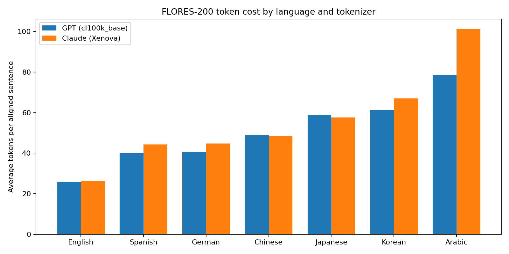

# Tokens Aren't Characters: A Cross-Lingual LLM Efficiency Study

## Can another language express the same meaning with fewer LLM tokens?

This experiment began with a conversation about reducing token usage when
working with large language models such as ChatGPT and Claude. A friend
suggested that Chinese might use fewer tokens because it can often express an
idea with fewer written characters than English.

That intuition is plausible, but character count and token count are not the
same thing. LLMs process text using tokenizer-specific pieces, and a tokenizer
may represent one character with one token, split it across several tokens, or
combine multiple characters into a single token. The vocabulary and training
data used to build the tokenizer therefore matter as much as the apparent
length of the text.

This project tests the hypothesis on professionally translated, semantically
aligned sentences, using both a GPT-family tokenizer and a Claude-compatible
tokenizer.

## Research question

> When the meaning is held approximately constant, which language uses the
> fewest tokens?

Some believe that Chinese would require fewer tokens because of
its compact writing system. A careful experiment using two widely used tokenizers
does not support this hypothesis. Across the languages tested, English required 
the fewest tokens under both tokenizers, while Chinese used about 89% more tokens 
under GPT and about 85% more under Claude.

## Dataset

The experiment uses the `dev` split of
[FLORES-200](https://huggingface.co/datasets/facebook/flores), a multilingual
translation benchmark published by Meta. FLORES contains the same source
material professionally translated into many languages, making it much more
suitable for this comparison than unrelated monolingual samples.

Seven languages are included:

- English (`eng_Latn`)
- Simplified Chinese (`zho_Hans`)
- Spanish (`spa_Latn`)
- Japanese (`jpn_Jpan`)
- Modern Standard Arabic (`arb_Arab`)
- Korean (`kor_Hang`)
- German (`deu_Latn`)

The script aligns translations by FLORES sentence ID and keeps only IDs shared
by every selected language. The resulting sample contains 997 aligned
sentences per language. Each ID is treated as one semantic unit.

## Tokenizers

Two tokenizers are measured on the same aligned sentences:

- **GPT (`cl100k_base`)** via OpenAI's [`tiktoken`](https://github.com/openai/tiktoken)
  library. This encoding is associated with GPT-4 and GPT-3.5-era models.
- **Claude (`Xenova/claude-tokenizer`)** via Hugging Face
  `AutoTokenizer`. Anthropic has not published the production tokenizer for
  Claude 3 and later. This public tokenizer is adapted from the tokenizer that
  previously shipped in the Anthropic Python SDK, and is the closest
  Claude-compatible local encoding available without calling the paid token
  counting API.

Special tokens are not added. The measurements therefore reflect the token
cost of the sentence text itself, not chat templates or message wrappers.

The findings remain tokenizer-specific. They should not be treated as exact
counts for every ChatGPT model, nor for current Claude 4 production billing.
The script still accepts an alternative installed `tiktoken` encoding, such as
`o200k_base`:

```powershell
python flores_token_costs.py --encoding o200k_base `
  --csv flores_o200k.csv --chart flores_o200k.png
```

## Methodology

For every aligned sentence in each language, the script:

1. Encodes the text with each tokenizer and counts the tokens.
2. Encodes the text as UTF-8 and counts the bytes.
3. Aggregates those measurements across all 997 sentences.

The reported metrics are:

- **Tokenizer:** which encoding produced the token counts.
- **Average tokens per sentence:** total tokens divided by aligned sentences.
  This is the main estimate of token cost per semantic unit.
- **Average bytes per sentence:** total UTF-8 bytes divided by aligned
  sentences. This is a tokenizer-independent measure of encoded text size,
  though it is not the same as character count.
- **Tokens per byte:** total tokens divided by total UTF-8 bytes. This indicates
  how densely the tokenizer represents the encoded text.
- **Number of sentences:** the number of IDs shared by every language.

Using aligned IDs controls the subject matter and approximate meaning. It does
not force translations to have identical wording or grammatical structure;
those natural differences are part of the real cost of expressing the same
idea in each language.

## Results

Results are sorted by average token count within each tokenizer, from lowest
to highest. Byte counts are identical across tokenizers because they depend
only on the UTF-8 text.

### GPT (`cl100k_base`)

| Language | Avg. tokens | Avg. UTF-8 bytes | Tokens/byte | Sentences |
|---|---:|---:|---:|---:|
| English | 25.88 | 125.67 | 0.2059 | 997 |
| Spanish | 40.01 | 152.54 | 0.2623 | 997 |
| German | 40.74 | 149.38 | 0.2727 | 997 |
| Chinese | 48.90 | 117.61 | 0.4158 | 997 |
| Japanese | 58.64 | 160.53 | 0.3653 | 997 |
| Korean | 61.35 | 151.37 | 0.4053 | 997 |
| Arabic | 78.46 | 201.18 | 0.3900 | 997 |

### Claude (`Xenova/claude-tokenizer`)

| Language | Avg. tokens | Avg. UTF-8 bytes | Tokens/byte | Sentences |
|---|---:|---:|---:|---:|
| English | 26.25 | 125.67 | 0.2089 | 997 |
| Spanish | 44.33 | 152.54 | 0.2906 | 997 |
| German | 44.77 | 149.38 | 0.2997 | 997 |
| Chinese | 48.50 | 117.61 | 0.4124 | 997 |
| Japanese | 57.63 | 160.53 | 0.3590 | 997 |
| Korean | 66.94 | 151.37 | 0.4423 | 997 |
| Arabic | 101.12 | 201.18 | 0.5026 | 997 |



The full-precision results are available in
[`flores_token_costs.csv`](flores_token_costs.csv).

## Findings

### 1. English used the fewest tokens on both tokenizers

English averaged 25.88 tokens per sentence under GPT and 26.25 under Claude.
Spanish and German were the next most token-efficient languages in both
rankings, at roughly 40–45 tokens per sentence.

This is not evidence that English is universally more concise. It shows that
both of these English-centric tokenizers represent the English translations in
this sample more efficiently than the other languages.

### 2. The language ranking did not change

Both tokenizers produced the same order:

English < Spanish < German < Chinese < Japanese < Korean < Arabic

Switching from GPT to Claude changed the magnitude of the cost, not which
language was cheapest for the same meaning.

### 3. Fewer bytes still did not mean fewer tokens

Chinese had the lowest average byte count: 117.61 bytes per sentence, about
6.4% below English. Despite that compact representation, it averaged 48.90
tokens under GPT and 48.50 under Claude—about 89% and 85% more than English,
respectively.

Chinese also had one of the highest token-to-byte ratios on both tokenizers.
The Chinese text was smaller in raw UTF-8 size but was split into
substantially more tokens.

This directly illustrates why visible character count, byte count, and token
count should not be used interchangeably.

### 4. Claude was slightly better on Chinese and Japanese, and worse on Arabic

Relative to GPT, the Claude tokenizer used:

- slightly fewer tokens for Chinese (48.50 vs 48.90) and Japanese (57.63 vs 58.64)
- slightly more tokens for English (26.25 vs 25.88)
- about 11% more tokens for Spanish and German
- about 9% more tokens for Korean
- about 29% more tokens for Arabic (101.12 vs 78.46)

Arabic remained the most expensive language in both cases, reaching just over
three times the English token count under GPT and about 3.85 times under
Claude. For applications processing large volumes of text, differences of
this size could materially affect context-window usage and API cost.

### 5. The original Chinese hypothesis was rejected on both tokenizers

The intuition behind the hypothesis was partly correct: Chinese expressed the
aligned content with fewer UTF-8 bytes than English. The conclusion about
tokens, however, did not follow. Under both `cl100k_base` and the public
Claude tokenizer, segmentation more than offset the compact written
representation.

## What the experiment does and does not show

This experiment measures input tokenization efficiency for one corpus and two
tokenizers. It does not measure:

- Model response quality in each language
- Output token usage
- Translation cost or latency
- Whether prompting in another language preserves every nuance
- Exact billed token counts for every ChatGPT model or current Claude 4 APIs
- The effect of system prompts, chat formatting, or tool-call metadata

Token count is only one part of LLM cost and performance. Translating a prompt
solely to save tokens may introduce ambiguity, reduce model quality, or cost
more than it saves. A model's actual tokenizer should always be tested before
making an optimization decision.

## Reproducing the experiment

### Requirements

- Python 3.10 or newer
- Access to the gated FLORES-200 dataset on Hugging Face
- `datasets`
- `tiktoken`
- `matplotlib`
- `transformers`

Install the Python dependencies:

```powershell
python -m pip install datasets tiktoken matplotlib transformers
```

Accept the dataset terms on the
[FLORES-200 page](https://huggingface.co/datasets/facebook/flores), then
authenticate:

```powershell
hf auth login
```

Alternatively, provide a Hugging Face token through the `HF_TOKEN` environment
variable. Do not commit the token to the repository.

Run the default experiment:

```powershell
python flores_token_costs.py
```

The script creates:

- `flores_token_costs.csv` — full-precision measurements for both tokenizers
- `flores_token_costs.png` — grouped bar chart sorted by GPT average token count

Custom output paths can be supplied with `--csv` and `--chart`:

```powershell
python flores_token_costs.py `
  --csv results.csv `
  --chart results.png
```

## Extending the experiment

Additional FLORES languages can be added to the `LANGUAGES` mapping in
`flores_token_costs.py`. For a meaningful comparison, every language should
continue to use the same split and the intersection of aligned sentence IDs.

A stricter Claude comparison would use Anthropic's `messages.count_tokens`
API, which matches current production billing but requires an API key and is
not a local tokenizer. Those counts should be reported separately rather than
mixed with `Xenova/claude-tokenizer`.

## Files

- `flores_token_costs.py` — experiment implementation
- `flores_token_costs.csv` — measured results
- `flores_token_costs.png` — visualization
- `README.md` — methodology, findings, and reproduction instructions
